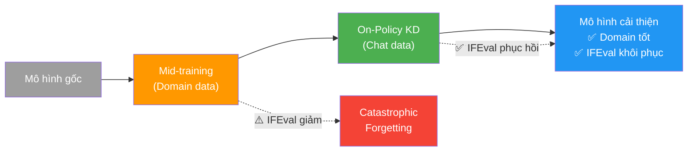
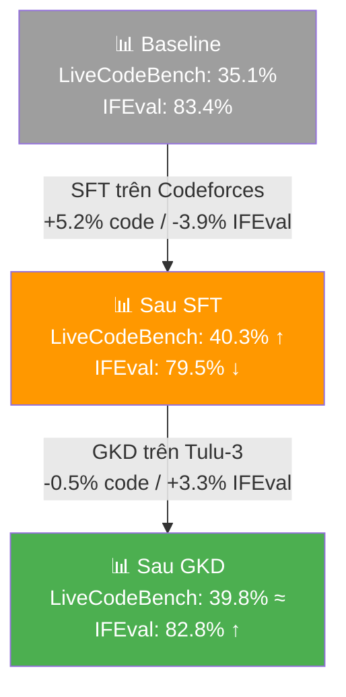
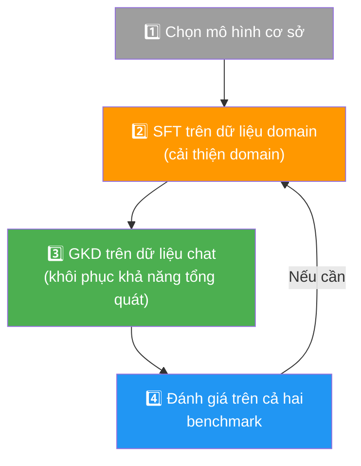

# Chương 7: Chưng cất Tri thức cho Domain Cụ thể

Chương này trình bày cách áp dụng on-policy distillation cho các **domain cụ thể**, giải quyết bài toán quan trọng: làm sao cải thiện hiệu suất trên domain chuyên biệt mà không đánh mất khả năng instruction following tổng quát.

---

## 7.1 Bài toán: Mất Khả năng Tổng quát khi Tinh chỉnh Domain

Trong bài blog của **Thinking Machines**, các tác giả đã chưng cất mô hình ngôn ngữ cho bài toán cá nhân hóa (personalisation). Họ cải thiện Qwen3-8B trên một tập dữ liệu nội bộ và **khôi phục lại** điểm số trên **IFEval** — benchmark đánh giá khả năng instruction following.

> **Vấn đề phổ biến:** Các mô hình thường **mất khả năng instruction following** khi được fine-tune cho domain cụ thể bằng SFT. Đây là hiện tượng **catastrophic forgetting** — mô hình học tốt trên domain mới nhưng quên đi kiến thức tổng quát đã có.

Thinking Machines giải quyết vấn đề này bằng cách **xen kẽ hai giai đoạn**:
1. **Continued pre-training** trên dữ liệu domain cụ thể — còn gọi là **mid-training**
2. **On-policy Distillation** với tập dữ liệu chat chất lượng cao



---

## 7.2 Tái tạo trong TRL với Mô hình và Dữ liệu Mở

Chúng tôi tái tạo quy trình trên trong **TRL** sử dụng các mô hình và tập dữ liệu mở:

| Thành phần | Tài nguyên sử dụng | Mục đích |
|:---|:---|:---|
| **Dữ liệu domain cụ thể** | `open-r1/codeforces` | Bài toán lập trình thi đấu |
| **Benchmark domain** | **LiveCodeBench** | Đánh giá khả năng code |
| **Dữ liệu chat tổng quát** | `allenai/tulu-3-sft-mixture` | Duy trì khả năng instruction following |
| **Benchmark tổng quát** | **IFEval** | Đánh giá instruction following |
| **Mô hình cơ sở** | `Qwen/Qwen3-4B-Instruct-2507` | Mô hình xuất phát |

---

## 7.3 Bước 1: Supervised Fine-Tuning trên Domain Code

Chúng tôi fine-tune mô hình trên tập dữ liệu `open-r1/codeforces`:

### Lệnh Huấn luyện SFT

```bash
accelerate launch \
  --config_file examples/accelerate_configs/multi_gpu.yaml trl/scripts/sft.py \
  --model_name_or_path Qwen/Qwen3-4B-Instruct-2507 \
  --dtype auto \
  --attn_implementation kernels-community/flash-attn \
  --dataset_name open-r1/codeforces-cots \
  --dataset_config solutions_decontaminated \
  --bf16 \
  --gradient_checkpointing \
  --per_device_train_batch_size 1 \
  --gradient_accumulation_steps 32 \
  --learning_rate 1e-5 \
  --num_train_epochs 1 \
  --max_length 16384 \
  --logging_steps 1 \
  --report_to trackio \
  --trackio_project Qwen3-4B-SFT-Codeforces \
  --output_dir data/Qwen3-4B-SFT-Codeforces \
  --push_to_hub \
  --hub_model_id <your-username>/Qwen3-4B-SFT-Codeforces \
  --seed 42 \
  --warmup_ratio 0.05 \
  --lr_scheduler_type cosine_with_min_lr \
  --use_liger_kernel
```

### Giải thích các tham số quan trọng

| Tham số | Giá trị | Ý nghĩa |
|:---|:---|:---|
| `learning_rate` | `1e-5` | Tốc độ học vừa phải cho fine-tuning |
| `gradient_accumulation_steps` | `32` | Tích lũy gradient qua 32 bước để tăng effective batch size |
| `max_length` | `16384` | Cho phép chuỗi dài (code thường dài) |
| `gradient_checkpointing` | Bật | Tiết kiệm bộ nhớ GPU |
| `use_liger_kernel` | Bật | Tối ưu kernel cho hiệu suất huấn luyện |

### Kết quả SFT

SFT **cải thiện hiệu suất trên domain code** nhưng đồng thời **làm giảm khả năng instruction following**:

| Benchmark | Trước SFT (Baseline) | Sau SFT | Thay đổi |
|:---|:---:|:---:|:---:|
| **LiveCodeBench** | 35.1% | 40.3% | 📈 **+5.2%** |
| **IFEval** | 83.4% | 79.5% | 📉 **-3.9%** |

> **Quan sát:** Đúng như dự đoán, SFT cải thiện domain (LiveCodeBench +5.2%) nhưng gây suy giảm khả năng tổng quát (IFEval -3.9%). Đây chính là catastrophic forgetting cần giải quyết.

---

## 7.4 Bước 2: Generalized Knowledge Distillation để Khôi phục IFEval

Bắt đầu từ **checkpoint SFT**, chúng tôi dùng **GKDTrainer** với tập dữ liệu chat tổng quát:

### Lệnh Huấn luyện GKD

```bash
accelerate launch \
  --config_file examples/accelerate_configs/multi_gpu.yaml trl/experimental/gold/gold.py \
  --model_name_or_path <sft-model> \
  --dtype auto \
  --attn_implementation kernels-community/flash-attn \
  --dataset_name allenai/tulu-3-sft-mixture \
  --dataset_train_split train \
  --bf16 \
  --learning_rate 1e-7 \
  --gradient_checkpointing \
  --per_device_train_batch_size 1 \
  --gradient_accumulation_steps 64 \
  --num_train_epochs 1 \
  --eval_strategy steps \
  --eval_steps 100 \
  --temperature 1.0 \
  --top_p 0.95 \
  --top_k 0 \
  --max_completion_length 2048 \
  --max_length 2560 \
  --lmbda 0.25 \
  --beta 0.0 \
  --use_uld_loss \
  --use_extended_uld \
  --uld_use_hybrid_loss \
  --uld_crossentropy_weight 0.0 \
  --uld_distillation_weight 1.0 \
  --uld_student_temperature 1.0 \
  --uld_teacher_temperature 1.0 \
  --uld_hybrid_unmatched_weight 1.0 \
  --uld_hybrid_matched_weight 1.0 \
  --teacher_model_name_or_path Qwen/Qwen3-4B-Instruct-2507 \
  --logging_steps 1 \
  --push_to_hub \
  --hub_model_id <your-username>/Qwen3-4B-GKD-Tulu \
  --report_to trackio \
  --trackio_project Qwen3-4B-GKD-Tulu \
  --seed 42 \
  --warmup_ratio 0.05 \
  --lr_scheduler_type cosine_with_min_lr
```

### Giải thích các tham số GKD quan trọng

| Tham số | Giá trị | Ý nghĩa |
|:---|:---|:---|
| `learning_rate` | `1e-7` | Rất thấp để tránh phá hỏng tri thức domain đã học |
| `lmbda` | `0.25` | 25% on-policy, 75% off-policy — cân bằng ổn định |
| `beta` | `0.0` | Sử dụng Forward KL divergence |
| `temperature` | `1.0` | Nhiệt độ sampling cho student |
| `max_completion_length` | `2048` | Độ dài tối đa phần completion |
| `use_uld_loss` | Bật | Sử dụng hàm mất mát ULD |
| `use_extended_uld` | Bật | Sử dụng phiên bản ULD mở rộng |
| `uld_use_hybrid_loss` | Bật | Kết hợp loss cho matched và unmatched tokens |
| `gradient_accumulation_steps` | `64` | Effective batch size lớn cho ổn định huấn luyện |

---

## 7.5 Kết quả Tổng hợp

| Giai đoạn | LiveCodeBench | IFEval | Ghi chú |
|:---|:---:|:---:|:---|
| **Baseline** (Qwen3-4B) | 35.1% | 83.4% | Mô hình gốc |
| **Sau SFT** (Codeforces) | 40.3% | 79.5% | 📈 Code tốt hơn, 📉 IFEval giảm |
| **Sau GKD** (Tulu-3) | 39.8% | 82.8% | ✅ Code duy trì, ✅ IFEval phục hồi |



### Phân tích Kết quả

- **SFT trên Codeforces** cải thiện LiveCodeBench từ 35.1% lên 40.3% (+5.2 điểm), nhưng IFEval giảm từ 83.4% xuống 79.5% (-3.9 điểm).
- **GKD trên Tulu-3** khôi phục IFEval từ 79.5% lên 82.8% (+3.3 điểm), trong khi LiveCodeBench chỉ giảm nhẹ từ 40.3% xuống 39.8% (-0.5 điểm — không đáng kể).

> **Kết luận:** Quy trình **SFT → GKD** cho phép **cải thiện domain cụ thể** (LiveCodeBench: 35.1% → 39.8%) **đồng thời duy trì khả năng tổng quát** (IFEval: 83.4% → 82.8%), với mức suy giảm IFEval gần như không đáng kể (-0.6 điểm).

---

## 7.6 Quy trình Tổng quát cho Bất kỳ Domain nào

Quy trình này có thể áp dụng cho **bất kỳ domain cụ thể** nào:



**Công thức chung:**
1. Chọn mô hình cơ sở phù hợp
2. **SFT** trên dữ liệu domain cụ thể → cải thiện hiệu suất domain
3. **GKD/GOLD** trên dữ liệu instruction following chất lượng cao → khôi phục khả năng tổng quát
4. Đánh giá trên cả benchmark domain và benchmark tổng quát
5. Lặp lại nếu cần

---

## Tổng kết Chương

Chương này chứng minh rằng on-policy distillation không chỉ hữu ích cho việc nén mô hình, mà còn là công cụ mạnh mẽ để **chống lại catastrophic forgetting** khi fine-tune domain cụ thể. Quy trình SFT → GKD cho phép đạt được **cải thiện domain** và **duy trì khả năng tổng quát** cùng một lúc.
