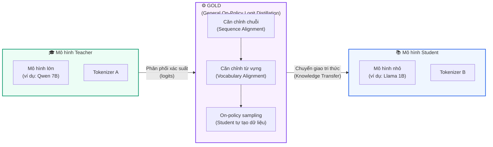

# Chương 1: Giới thiệu

:::info Lưu ý về bản dịch
Đây là bản dịch tiếng Việt của bài viết **\"Unlocking On-Policy Distillation for Any Model Family\"** bởi đội ngũ HuggingFace H4.

📄 Bài viết gốc: [https://huggingface.co/spaces/HuggingFaceH4/on-policy-distillation](https://huggingface.co/spaces/HuggingFaceH4/on-policy-distillation)

✍️ **Tác giả:** Carlos Miguel Patiño, Kashif Rasul, Quentin Gallouédec, Ben Burtenshaw, Sergio Paniego, Vaibhav Srivastav, Thibaud Frere, Ed Beeching, Lewis Tunstall, Leandro von Werra, Thomas Wolf

📅 **Ngày xuất bản:** 29 tháng 10, 2025
:::

## Tổng quan

**On-policy distillation** là một chiến lược cực kỳ hiệu quả để nén các mô hình ngôn ngữ lớn (LLM), như đã được nhấn mạnh gần đây trong bài blog xuất sắc của Thinking Machines. Kỹ thuật này huấn luyện một mô hình nhỏ hơn (student) bằng cách học từ phân phối xác suất của một mô hình lớn hơn (teacher). Nhờ đó, student có thể bắt chước năng lực của teacher với kích thước nhỏ hơn nhiều và độ trễ thấp hơn.

Trong bài viết này, chúng tôi giới thiệu **GOLD — General On-Policy Logit Distillation**, phương pháp giúp mở rộng on-policy distillation vượt qua một ràng buộc cơ bản: **yêu cầu teacher và student phải dùng chung tokenizer**.

Được xây dựng dựa trên **Universal Logit Distillation (ULD)** (Boizard et al., 2025), GOLD đặc biệt hiệu quả cho các nhiệm vụ suy luận phức tạp nhiều bước, như toán học. Kết quả cho thấy GOLD vượt trội so với cả ULD lẫn **GRPO** (Group Relative Policy Optimization).

## Đóng góp chính

Các đóng góp chính của chúng tôi bao gồm:

- **Triển khai mã nguồn mở** các phương pháp on-policy distillation trong thư viện TRL (bao gồm GKD và GOLD) và chứng minh hiệu quả trên nhiều tổ hợp mô hình khác nhau.
- **Mở rộng ULD sang thiết lập on-policy**, trong đó student tự sinh câu trả lời và được căn chỉnh theo phân phối xác suất của teacher.
- **Triển khai các phương pháp căn chỉnh chuỗi và từ vựng mới** giúp cải thiện hiệu suất chưng cất khi student và teacher dùng tokenizer khác nhau.

## Sơ đồ tổng quan

Dưới đây là sơ đồ tổng quan về cách GOLD hoạt động, cho phép chưng cất tri thức giữa các mô hình có tokenizer khác nhau:

## Tiếp theo

Với nền tảng này, hãy cùng nhìn lại bức tranh toàn cảnh của các phương pháp **knowledge distillation** — on-policy distillation ra đời như thế nào, và tại sao việc mở rộng chúng vượt ra ngoài ràng buộc chung tokenizer lại quan trọng đến vậy.

➡️ Tiếp theo: [Chương 2: Phương pháp Chưng cất Tri thức](./phuong_phap_chung_cat.md)
