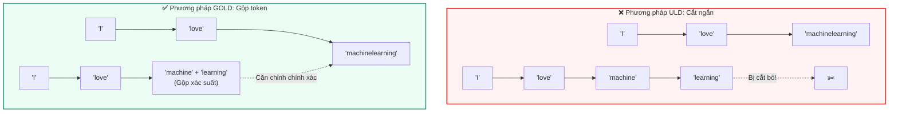
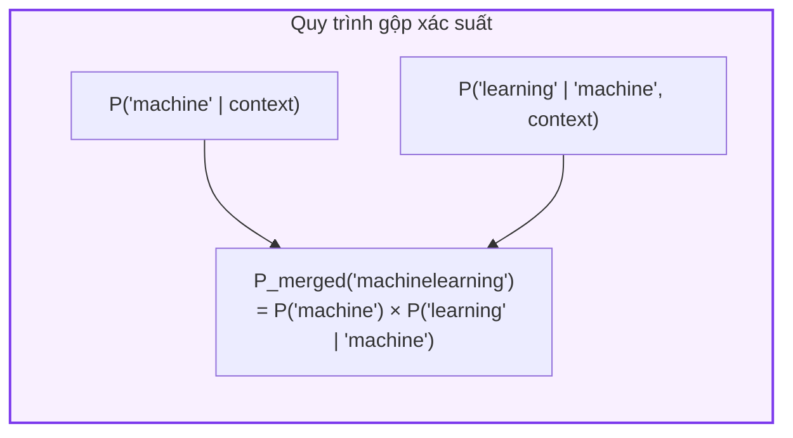
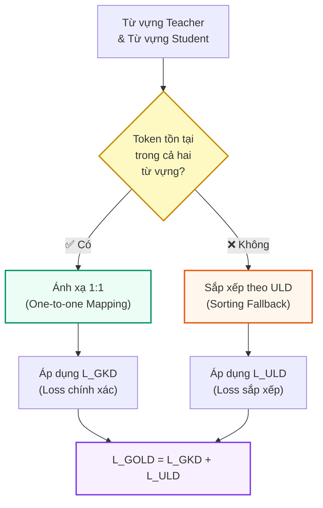

# Chương 3: Thuật toán GOLD (General On-Policy Logit Distillation)

GOLD giải quyết hai hạn chế chính khi chưng cất giữa các mô hình có tokenizer khác nhau: **lệch chuỗi** (sequence misalignment) và **lệch từ vựng** (vocabulary misalignment).

## 1. Căn chỉnh chuỗi (Sequence Alignment)

### Vấn đề với ULD

Hạn chế đầu tiên là phương pháp căn chỉnh chuỗi của ULD — vốn chỉ đơn giản **cắt ngắn (truncate)** các chuỗi về độ dài token hóa nhỏ nhất. Cách tiếp cận này gây ra hai vấn đề:

1. **Mất thông tin ở cuối văn bản:** Các token ở phần cuối chuỗi dài hơn bị bỏ qua hoàn toàn.
2. **Lệch ngữ nghĩa giữa các token:** Các token tại cùng một vị trí trong chuỗi có thể mang ý nghĩa hoàn toàn khác nhau.

### Giải pháp: Gộp token (Token Merging)

Thay vì cắt ngắn, phương pháp của chúng tôi xác định các **phép gộp token** cần thiết để cân bằng độ dài chuỗi cho cả hai tokenizer, rồi **gộp xác suất** tại các vị trí tương ứng bằng cách nhân phân phối biên (marginal distribution) với các xác suất có điều kiện vô hướng của token tiếp theo.

Sử dụng xác suất có điều kiện và **quy tắc nhân xác suất**, chúng tôi có thể gộp xác suất và đảm bảo căn chỉnh chuỗi bất kể sự khác biệt giữa các tokenizer:

$$P_{\text{merged}}(y) = P(y \mid x) \times P(\text{token}_1 \mid x) \times P(\text{token}_2 \mid \text{token}_1, x) \times \dots$$

Trong đó:
- $P(y \mid x)$ là xác suất của chuỗi đầu ra $y$ khi cho đầu vào $x$
- Mỗi thừa số $P(\text{token}_i \mid \text{token}_{i-1}, x)$ là xác suất có điều kiện của token tiếp theo, cho phép "gộp" nhiều token nhỏ thành một token lớn tương đương

:::tip Ưu điểm
Phương pháp gộp token đảm bảo **không mất thông tin** và **căn chỉnh ngữ nghĩa chính xác** — mỗi vị trí trong chuỗi đã căn chỉnh đều đại diện cho cùng một đoạn văn bản, bất kể tokenizer chia nó thành bao nhiêu phần.
:::

## 2. Căn chỉnh từ vựng (Vocabulary Alignment)

### Vấn đề với phương pháp sắp xếp của ULD

ULD xử lý sự khác biệt từ vựng bằng cách **sắp xếp (sorting)** các logit theo thứ tự giảm dần và so khớp theo vị trí. Tuy nhiên, cách này bỏ qua thực tế rằng nhiều token **tồn tại trong cả hai từ vựng** — chỉ khác mã ID.

### Giải pháp: Ánh xạ một-một kết hợp sắp xếp dự phòng

Cải tiến thứ hai của chúng tôi thay thế thao tác sắp xếp bằng một thao tác tận dụng **ánh xạ một-một (one-to-one mapping)** tiềm năng giữa các tokenizer.

Quy trình hoạt động như sau:

1. **Tìm ánh xạ trực tiếp:** Xác định các token tồn tại trong cả hai từ vựng và tạo ánh xạ 1:1 giữa chúng.
2. **Áp dụng hàm mất mát GKD:** Với các token đã ánh xạ, áp dụng trực tiếp hàm mất mát GKD.
3. **Dự phòng bằng ULD:** Với các token **không có ánh xạ**, quay lại dùng quy trình sắp xếp từ ULD.

### Hàm mất mát tổng hợp của GOLD

Hàm mất mát của GOLD là tổng của $\mathcal{L}_{GKD}$ từ các token có ánh xạ một-một và $\mathcal{L}_{ULD}$ từ các token không có ánh xạ:

$$\mathcal{L}_{GOLD} = \mathcal{L}_{GKD}^{\text{(matched)}} + \mathcal{L}_{ULD}^{\text{(unmatched)}}$$

:::info Tại sao kết hợp cả hai?
Việc kết hợp hai hàm mất mát cho phép GOLD tận dụng tối đa thông tin ánh xạ trực tiếp khi có thể (chính xác hơn), đồng thời không bỏ sót các token chỉ tồn tại trong một từ vựng (toàn diện hơn).
:::

## Tóm tắt so sánh

| Khía cạnh | ULD | GOLD |
|---|---|---|
| **Căn chỉnh chuỗi** | Cắt ngắn (truncation) | Gộp token (token merging) |
| **Căn chỉnh từ vựng** | Sắp xếp (sorting) | Ánh xạ 1:1 + sắp xếp dự phòng |
| **Mất thông tin** | Có (cuối chuỗi) | Không |
| **Thiết lập** | Off-policy | On-policy |
| **Độ chính xác ngữ nghĩa** | Trung bình | Cao |

---

➡️ Tiếp theo: [Chương 4: Thiết lập Thí nghiệm](./thiet_lap_thi_nghiem.md)
