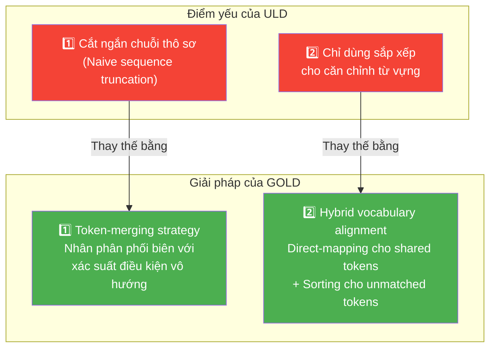
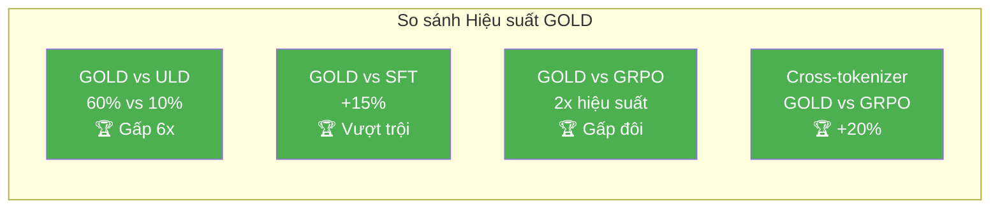

# Chương 8: Kết luận & Tài liệu Tham khảo

---

## 8.1 Kết luận

Trong bài viết này, chúng tôi đã giới thiệu **GOLD** (General On-Policy Logit Distillation — Chưng cất Logit On-Policy Tổng quát), một phương pháp mới cho phép **chưng cất tri thức on-policy hiệu quả giữa các mô hình**, ngay cả khi teacher và student **không chia sẻ cùng từ vựng tokenizer**.

### GOLD Được Xây dựng trên ULD

GOLD được xây dựng dựa trên phương pháp **ULD** (Universal Logit Distillation — Chưng cất Logit Phổ quát) offline nhưng **mở rộng nó sang bối cảnh on-policy** và giải quyết **hai điểm yếu chính** của ULD:



**Thứ nhất**, chúng tôi thay thế phương pháp **cắt ngắn chuỗi thô sơ** (naive sequence truncation) của ULD bằng **chiến lược gộp token** (token-merging strategy). Chiến lược này nhân các **phân phối biên** (marginal distributions) với các **xác suất điều kiện vô hướng** (scalar conditional probabilities), cho phép xử lý sự khác biệt về phân đoạn chuỗi giữa hai tokenizer một cách chính xác hơn.

**Thứ hai**, chúng tôi triển khai **phương pháp căn chỉnh từ vựng lai** (hybrid vocabulary alignment method). Phương pháp này sử dụng **hàm mất mát ánh xạ trực tiếp** (direct-mapping loss) cho các token được chia sẻ giữa hai tokenizer, và chỉ **quay lại phương pháp sắp xếp** (sorting method) của ULD cho các token không khớp (unmatched tokens).

---

## 8.2 Tổng hợp Kết quả Thí nghiệm

Các thí nghiệm trên bài toán Countdown xác nhận những ưu điểm của GOLD:

### Kết quả Chính

| Phát hiện | Chi tiết |
|:---|:---|
| **GOLD vượt trội ULD** | Khôi phục **60%** hiệu suất teacher, so với chỉ **10%** của ULD |
| **GOLD vượt trội SFT** | Cải thiện hơn SFT **15%** |
| **GOLD vượt trội GRPO** | Hiệu suất gấp **2 lần** so với GRPO (cùng tokenizer) |
| **Cross-tokenizer** | Ngay cả trong kịch bản khó (khác tokenizer), GOLD vẫn vượt trội GRPO **20%** |



### Ý nghĩa

Những phát hiện này chứng minh rằng GOLD là một kỹ thuật **mạnh mẽ và linh hoạt** cho chưng cất mô hình. Nó cung cấp con đường để **chưng cất tri thức từ bất kỳ teacher hiệu suất cao nào sang bất kỳ student nào**, bất kể tokenizer của chúng, mang đến một giải pháp thay thế **hiệu quả hơn và tiết kiệm token hơn** so với học tăng cường (reinforcement learning).

> **Tầm nhìn:** GOLD mở ra khả năng chưng cất tri thức tự do giữa các họ mô hình (model families) — ví dụ từ Qwen sang LLaMA, từ GPT sang Mistral — mà không bị ràng buộc bởi sự khác biệt tokenizer. Đây là bước tiến quan trọng hướng tới việc dân chủ hóa tri thức AI.

---

## 8.3 Tài liệu Tham khảo

1. Agarwal, R., et al. (2024). *On-Policy Distillation of Language Models: Learning from Self-Generated Mistakes*. [https://huggingface.co/papers/2306.13649](https://huggingface.co/papers/2306.13649)

2. Boizard, N., et al. (2025). *Towards Cross-Tokenizer Distillation: the Universal Logit Distillation Loss for LLMs*. [https://huggingface.co/papers/2402.12030](https://huggingface.co/papers/2402.12030)

3. DeepSeek-AI, et al. (2025). *DeepSeek-R1: Incentivizing Reasoning Capability in LLMs via Reinforcement Learning*. [https://huggingface.co/papers/2501.12948](https://huggingface.co/papers/2501.12948)

4. Gandhi, K., et al. (2024). *Stream of Search (SoS): Learning to Search in Language*. [https://huggingface.co/papers/2404.03683](https://huggingface.co/papers/2404.03683)

5. Shao, Z., et al. (2024). *DeepSeekMath: Pushing the Limits of Mathematical Reasoning in Open Language Models*. [https://huggingface.co/papers/2402.03300](https://huggingface.co/papers/2402.03300)

6. Yang, A., et al. (2025). *Qwen3 Technical Report*. [https://huggingface.co/papers/2505.09388](https://huggingface.co/papers/2505.09388)

---

## 8.4 Trích dẫn

Nếu bạn sử dụng hoặc tham khảo công trình này, vui lòng trích dẫn:

```
Carlos Miguel Patiño, Kashif Rasul, Quentin Gallouédec, Ben Burtenshaw, Sergio Paniego, Vaibhav Srivastav, Thibaud Frere, Ed Beeching, Lewis Tunstall, Leandro von Werra, Thomas Wolf (2025). "Unlocking On-Policy Distillation for Any Model Family".
```

### BibTeX

```bibtex
@misc{patiño2025_unlocking_on_policy_distillation_for_any_model_family,
  title={Unlocking On-Policy Distillation for Any Model Family},
  author={Carlos Miguel Patiño and Kashif Rasul and Quentin Gallouédec and Ben Burtenshaw and Sergio Paniego and Vaibhav Srivastav and Thibaud Frere and Ed Beeching and Lewis Tunstall and Leandro von Werra and Thomas Wolf},
  year={2025},
}
```

---

## 8.5 Về bản dịch

Bản dịch tiếng Việt này được thực hiện bởi **[tuandung222](https://github.com/tuandung222)**.

| Thông tin | Chi tiết |
|:---|:---|
| **Người dịch** | tuandung222 |
| **Nguồn gốc** | Bài blog *"Unlocking On-Policy Distillation for Any Model Family"* của Hugging Face |
| **Mục đích** | Phổ biến kiến thức về chưng cất tri thức on-policy cho cộng đồng AI Việt Nam |
| **Nguyên tắc dịch** | Giữ nguyên các thuật ngữ kỹ thuật quan trọng bằng tiếng Anh, kèm giải thích tiếng Việt khi giới thiệu lần đầu |

> **Lưu ý:** Bản dịch này nhằm mục đích giáo dục và phổ biến kiến thức. Mọi công thức toán học, mã nguồn, và tài liệu tham khảo đều được giữ nguyên bản gốc. Nếu phát hiện lỗi dịch thuật, vui lòng liên hệ người dịch hoặc mở issue trên repository.

---

*Cảm ơn bạn đã đọc loạt bài về On-Policy Distillation! Hy vọng tài liệu này hữu ích cho hành trình nghiên cứu và ứng dụng AI của bạn.* 🚀
