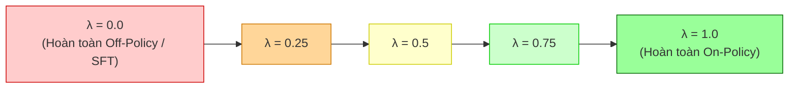
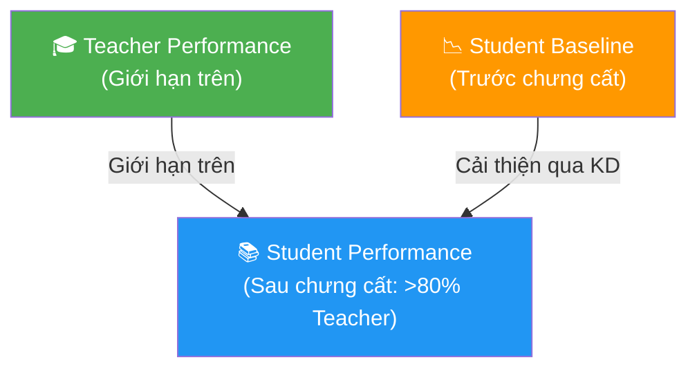
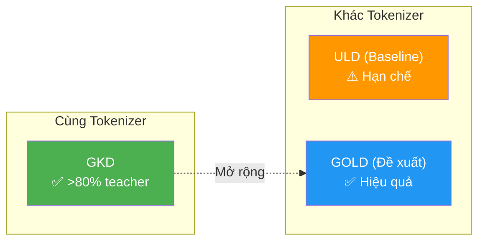
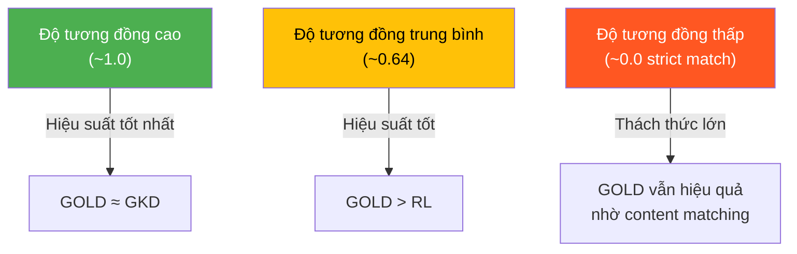
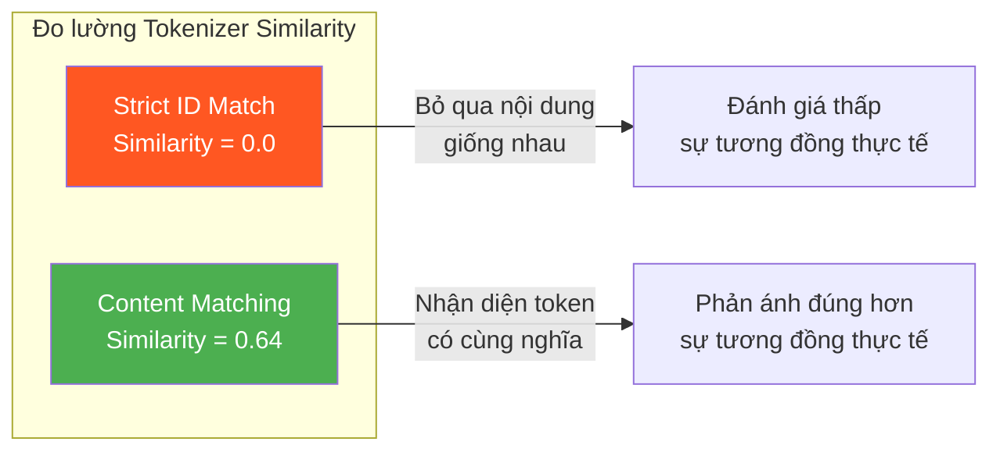

# Chương 5: Kết quả Thí nghiệm

Chương này trình bày các kết quả thí nghiệm chi tiết, từ việc xác nhận hiệu quả của GKD (Generalized Knowledge Distillation — Chưng cất Tri thức Tổng quát) đến so sánh các phương pháp GOLD và ULD trong các kịch bản tokenizer khác nhau.

---

## 5.1 GKD với Cùng Tokenizer

Mục tiêu đầu tiên của chúng tôi là **xác nhận (validate)** triển khai GKD bằng cách so sánh kết quả với những gì Agarwal và cộng sự đã báo cáo. Chúng tôi tập trung vào việc so sánh hiệu suất khi kết hợp học **on-policy** (học trên dữ liệu do chính mô hình sinh ra) và **off-policy** (học trên dữ liệu có sẵn) thông qua thí nghiệm **ablation** (phân tích loại bỏ từng thành phần) với năm giá trị $\lambda$ khác nhau.

### Cấu hình thí nghiệm

| Thành phần | Chi tiết |
|:---|:---|
| **Mô hình Teacher** | `Qwen/Qwen3-4B-Instruct-2507` |
| **Mô hình Student** | `Qwen/Qwen2.5-1.5B-Instruct` |
| **Nhiệt độ sinh** | $\gamma = 1$ |
| **Hàm mất mát** | Forward KL divergence ($\beta = 0$) trong $\mathcal{L}_{OD}$ |
| **Giá trị $\lambda$ thử nghiệm** | 0.0, 0.25, 0.5, 0.75, 1.0 |

### Vai trò của tham số $\beta$

Tham số $\beta$ điều khiển **generalized Jensen-Shannon divergence** (phân kỳ Jensen-Shannon tổng quát):

$$\mathcal{D}_{\text{JSD}(\beta)}(p_S, p_T) = \beta \cdot D_{\text{KL}}(p_S \| \pi) + (1-\beta) \cdot D_{\text{KL}}(p_T \| \pi)$$

trong đó:

$$\pi = \beta \cdot p_S + (1-\beta) \cdot p_T$$

- Khi $\beta = 0$: sử dụng **Forward KL divergence** — student cố gắng bao phủ toàn bộ phân phối của teacher.
- Khi $\beta = 1$: sử dụng **Reverse KL divergence** — student tập trung vào các mode chính của phân phối teacher.
- Khi $0 < \beta < 1$: kết hợp cả hai hướng, cân bằng giữa bao phủ và tập trung.

### Kết quả Ablation theo $\lambda$

Kết quả xác nhận rằng việc sử dụng **ít nhất một mức độ huấn luyện on-policy** đều vượt trội so với cấu hình SFT (Supervised Fine-Tuning — Tinh chỉnh có giám sát) thuần túy. Chúng tôi cũng quan sát thấy xu hướng hiệu suất tốt hơn khi tăng $\lambda$, với chế độ **hoàn toàn on-policy** ($\lambda = 1.0$) đạt hiệu suất tổng thể tốt nhất.

> **Nhận xét quan trọng:** Ngay cả một tỷ lệ nhỏ dữ liệu on-policy ($\lambda = 0.25$) cũng cải thiện đáng kể so với việc chỉ dùng dữ liệu off-policy ($\lambda = 0$).

---

## 5.2 Tri thức Teacher được Chưng cất Thành công

Sau khi thử nghiệm nhiều cấu hình khác nhau, chúng tôi đạt được một thiết lập có thể **chưng cất nhất quán trên 80%** hiệu suất của teacher trên bài toán Countdown. Tỷ lệ chưng cất cao này đúng với **nhiều mô hình teacher có kích thước khác nhau**, xác nhận tính hiệu quả của triển khai GKD on-policy.

| Mô hình Teacher | Kích thước | Hiệu suất Teacher | Hiệu suất Student sau KD | Tỷ lệ khôi phục |
|:---|:---:|:---:|:---:|:---:|
| Qwen3-4B | 4B | Baseline | > 80% teacher | ✅ Cao |
| Các mô hình khác | Đa dạng | Đa dạng | > 80% teacher | ✅ Cao |

Những kết quả này nhấn mạnh một điểm cơ bản: **hiệu suất của student bị giới hạn bởi năng lực của teacher**. Một student không thể vượt qua teacher thông qua chưng cất — nó chỉ có thể tiệm cận hiệu suất của teacher.

---

## 5.3 On-Policy Distillation Hoạt động với Tokenizer Khác nhau

Mặc dù triển khai GKD của chúng tôi đã khôi phục được hơn 80% hiệu suất teacher, nó bị **giới hạn với các cặp teacher-student có cùng tokenizer**. Để vượt qua giới hạn này, chúng tôi so sánh phương pháp **ULD** (Universal Logit Distillation — Chưng cất Logit Phổ quát) baseline với phương pháp **GOLD** (General On-Policy Logit Distillation — Chưng cất Logit On-Policy Tổng quát) mà chúng tôi đề xuất.

---

## 5.4 Độ Tương đồng Tokenizer Ảnh hưởng đến Hiệu suất

**Độ tương đồng tokenizer** (tokenizer similarity) quyết định mức độ cần thiết của việc **căn chỉnh chuỗi** (sequence alignment) và **căn chỉnh từ vựng** (vocabulary alignment). Hiệu suất của GOLD trên bài toán Countdown **giảm khi độ tương đồng tokenizer giảm**.

Tuy nhiên, điều quan trọng cần lưu ý: **GOLD ở mức tương đồng 0.64 vẫn vượt trội so với các phương pháp RL** (Reinforcement Learning — Học tăng cường).

---

## 5.5 GOLD Vượt trội so với ULD

Chúng tôi tiến hành thử nghiệm bằng cách huấn luyện `meta-llama/Llama-3.2-1B-Instruct` (student) với `Qwen/Qwen3-4B-Instruct-2507` (teacher):

### Kết quả so sánh chi tiết

| Phương pháp | Cải thiện so với Baseline | Tỷ lệ khôi phục Teacher | Ghi chú |
|:---|:---:|:---:|:---|
| **GOLD** | **+25%** | **60%** | Hiệu quả vượt trội |
| **ULD** | +5% | 10% | Cải thiện hạn chế |

### Phân tích Tokenizer Similarity

Cặp student-teacher này có **độ tương đồng 0** theo phương pháp **strict ID match** (so khớp ID chính xác), nhưng phương pháp **token content matching** (so khớp nội dung token) tăng con số này lên **0.64**.

> **Ý nghĩa thực tiễn:** Phương pháp đo lường độ tương đồng tokenizer rất quan trọng. Strict ID match có thể đánh giá quá thấp sự tương đồng thực tế giữa các tokenizer từ các họ mô hình khác nhau, trong khi content matching cho kết quả phản ánh chính xác hơn khả năng chưng cất tri thức giữa chúng.

---

## Tổng kết Chương

Các thí nghiệm trong chương này chứng minh ba điều quan trọng:

1. **On-policy luôn tốt hơn off-policy** — ngay cả với $\lambda$ nhỏ, on-policy đã cải thiện đáng kể.
2. **GKD chưng cất hiệu quả >80% tri thức teacher** — nhưng bị giới hạn bởi cùng tokenizer.
3. **GOLD mở rộng khả năng chưng cất ra khác tokenizer** — vượt trội ULD 5x về tỷ lệ khôi phục hiệu suất teacher (60% vs 10%).
