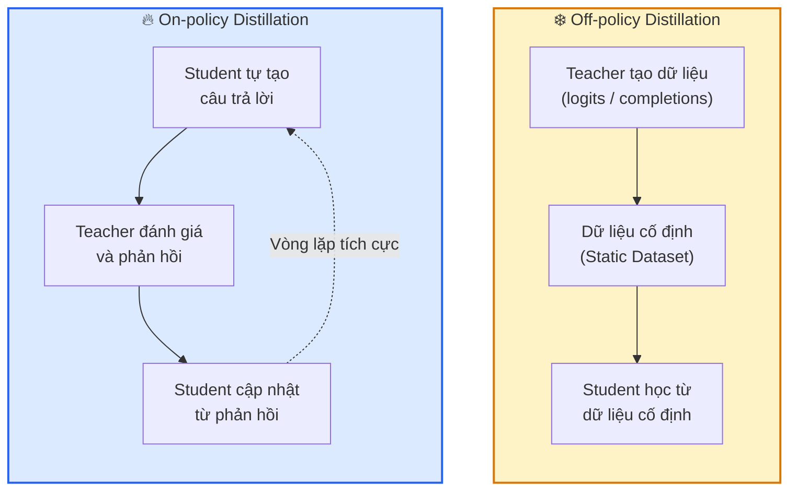
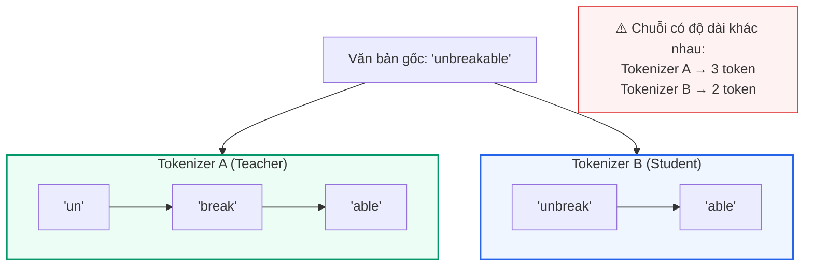
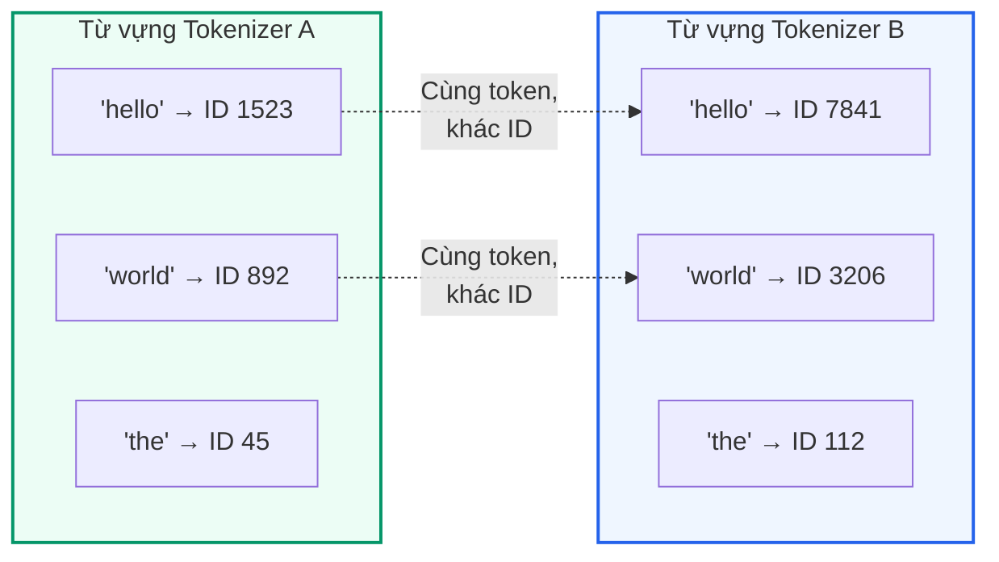

# Chương 2: Phương pháp Chưng cất Tri thức (Knowledge Distillation)

## Off-policy và On-policy Distillation

Có hai loại chưng cất chính: **off-policy** và **on-policy**.

- **Off-policy distillation** (chưng cất ngoài chính sách) huấn luyện mô hình student trên dữ liệu cố định — thường là các **logits** (giá trị đầu ra thô trước khi áp dụng softmax) hoặc các câu trả lời văn bản đã được tính toán trước từ teacher.
- **On-policy distillation** (chưng cất theo chính sách) cho phép teacher cung cấp phản hồi trực tiếp trên chính các đầu ra mà student tự tạo ra.

## Generalised Knowledge Distillation (GKD)

**Generalised Knowledge Distillation (GKD)** (Agarwal et al., 2024) — Chưng cất Tri thức Tổng quát — thống nhất cả hai phương pháp trên dưới một khung lý thuyết chung bằng cách hỗ trợ nhiều hàm mất mát (loss function) khác nhau, cho phép huấn luyện trên cả dữ liệu tĩnh của teacher lẫn các quỹ đạo (trajectories) do student tự tạo ra. Bài báo GKD chỉ ra rằng **on-policy distillation thường vượt trội hơn các phương pháp off-policy**.

### Tại sao On-policy hiệu quả hơn?

Ưu thế của on-policy distillation đến từ hai yếu tố:

1. **Vòng phản hồi tích cực (positive feedback loop):** Khi mô hình student cải thiện, các câu trả lời mà nó tạo ra sẽ ngày càng chất lượng hơn, tạo thành dữ liệu huấn luyện tốt hơn theo thời gian.
2. **Căn chỉnh ngữ cảnh (context alignment):** Phương pháp này buộc student phải học từ chính những loại lỗi và thành công mà nó sẽ gặp phải trong quá trình suy luận thực tế (inference).

### Tham số λ và hàm mất mát GKD

GKD điều khiển tỷ lệ trộn dữ liệu on-policy và off-policy thông qua **tham số $\lambda$**:
- $\lambda = 1$: hoàn toàn on-policy (student tự tạo toàn bộ dữ liệu)
- $\lambda = 0$: hoàn toàn offline (chỉ dùng dữ liệu cố định từ teacher)

Hàm mất mát đầy đủ của GKD được định nghĩa như sau:

$$\mathcal{L}_{GKD} := (1-\lambda) \mathbb{E}_{(x,y)\sim (X,Y)}[\mathcal{D}_{JSD(\beta)}] + \lambda \mathbb{E}_{x \sim X}[\mathbb{E}_{y \sim p_{S}(.|x)}[\mathcal{D}_{JSD(\beta)}]]$$

Trong đó:
- $(x, y)$ là cặp đầu vào và đầu ra từ tập dữ liệu
- $p_S(.|x)$ là phân phối xác suất của student khi cho đầu vào $x$
- $\mathcal{D}_{JSD(\beta)}$ là **Jensen-Shannon Divergence** (độ phân kỳ Jensen-Shannon) — một thước đo khoảng cách giữa hai phân phối xác suất, với tham số $\beta$ điều chỉnh trọng số

### So sánh với Reinforcement Learning (RL)

So với học tăng cường (RL), GKD có hai lợi thế chính:

| | GKD | RL (ví dụ: GRPO) |
|---|---|---|
| **Tín hiệu phản hồi** | Phân phối xác suất liên tục từ teacher (dense signal) | Hàm thưởng cho tín hiệu thưa (sparse reward) |
| **Mô hình nhỏ** | Hoạt động tốt ngay cả với mô hình có hiệu suất ban đầu thấp | Khó học khi mô hình ban đầu quá yếu |

## Universal Logit Distillation (ULD)

### Hạn chế của các phương pháp trước đây

Hạn chế chính của **tất cả** các phương pháp on-policy distillation trước đây là chúng giả định teacher và student sử dụng **cùng một tokenizer**. Mỗi họ mô hình (model family) sử dụng tokenizer riêng, nên yêu cầu dùng chung tokenizer tạo ra ràng buộc quá chặt khi chọn cặp student-teacher.

### Hai thách thức khi tokenizer khác nhau

**ULD** (Boizard et al., 2025) đã chỉ ra rằng việc sử dụng chưng cất giữa các mô hình có tokenizer khác nhau dẫn đến hai thách thức chính:

#### 1. Lệch chuỗi (Sequence Misalignment)

Các tokenizer khác nhau chia văn bản theo cách khác nhau, dẫn đến chuỗi token có **độ dài khác nhau** cho cùng một đoạn văn bản.

#### 2. Lệch từ vựng (Vocabulary Misalignment)

Cùng một chuỗi ký tự token nhưng nhận các **ID khác nhau** trong từ vựng của mỗi tokenizer.

Đây chính là hai vấn đề mà phương pháp **GOLD** được thiết kế để giải quyết, như chúng ta sẽ thấy trong chương tiếp theo.

---

➡️ Tiếp theo: [Chương 3: Thuật toán GOLD](./gold_algorithm.md)
