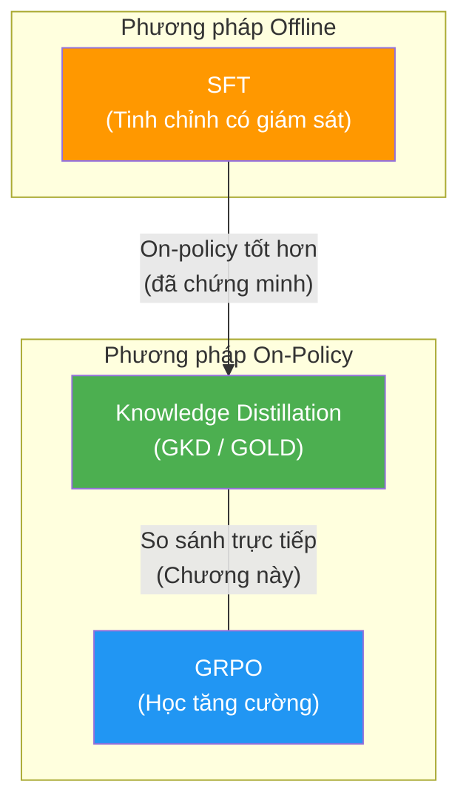
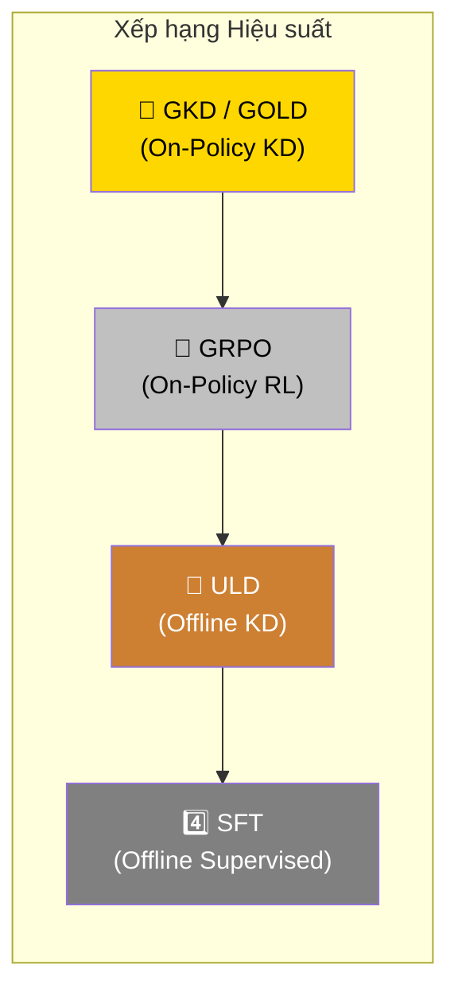
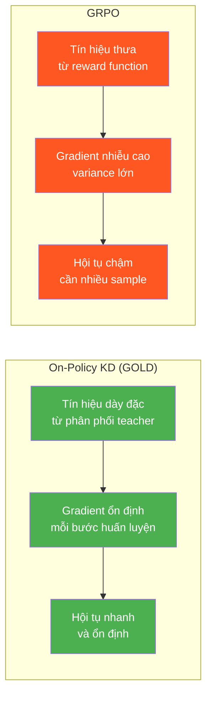

# Chương 6: On-Policy Distillation Vượt trội so với GRPO

Chương này so sánh phương pháp **on-policy distillation** (chưng cất trên chính sách hiện hành) với **GRPO** (Group Relative Policy Optimization — Tối ưu hóa Chính sách Tương đối theo Nhóm), một phương pháp **RL** (Reinforcement Learning — Học tăng cường) phổ biến. Kết quả cho thấy chưng cất tri thức on-policy vượt trội đáng kể so với GRPO trong cả hai kịch bản cùng và khác tokenizer.

---

## 6.1 Tại sao So sánh với GRPO?

**On-policy distillation** sử dụng các đoạn hoàn thành (completions) do student tự sinh ra để cập nhật dữ liệu huấn luyện một cách liên tục. Sau khi đã chứng minh rằng cách tiếp cận này vượt trội so với các phương pháp **offline** như SFT (Supervised Fine-Tuning), chúng tôi tiến hành so sánh nó với **GRPO**.

**GRPO** là phương pháp RL được giới thiệu trong bài báo **DeepSeek-Math** (Shao và cộng sự, 2024) và sau đó trở nên phổ biến rộng rãi nhờ bản phát hành **DeepSeek R1**. GRPO tối ưu hóa chính sách bằng cách so sánh phần thưởng tương đối giữa các ứng viên trong cùng một nhóm, thay vì sử dụng một mô hình giá trị (value model) riêng biệt.

---

## 6.2 Thiết kế Hàm Phần thưởng (Reward Function)

Chúng tôi tuân theo hướng dẫn của **Philipp Schmid** về cách huấn luyện GRPO cho bài toán **Countdown**. Hàm phần thưởng (reward function) của chúng tôi là **tổng của ba thành phần**:

| # | Thành phần | Điểm | Mô tả |
|:---:|:---|:---:|:---|
| 1 | **Format** (Định dạng) | +1 | Nếu phản hồi bao gồm các thẻ đáp án (answer tags) đúng cách |
| 2 | **Following Rules** (Tuân thủ Quy tắc) | +1 | Nếu mô hình tuân thủ quy tắc sử dụng các số được cung cấp và chỉ sử dụng mỗi số một lần |
| 3 | **Correct Equation** (Phương trình Đúng) | +1 | Nếu phương trình đưa ra là đúng |

> **Lưu ý kỹ thuật:** Bài hướng dẫn gốc gộp phần thưởng **Format** và **Following Rules** vào một hàm duy nhất, nhưng chúng tôi nhận thấy kết quả tốt hơn khi **tách riêng** chúng thành hai hàm phần thưởng độc lập. Việc tách riêng giúp mô hình nhận tín hiệu phản hồi rõ ràng hơn cho từng khía cạnh.

---

## 6.3 Kết quả So sánh

### Kịch bản 1: Cùng Tokenizer

Kết quả cho kịch bản cùng tokenizer cho thấy **KD vượt trội GRPO gấp 2 lần!**

### Kịch bản 2: Khác Tokenizer

Kịch bản với tokenizer khác nhau có khoảng cách hẹp hơn nhưng **GOLD vẫn vượt trội GRPO 20%**.

---

## 6.4 Bảng So sánh Tổng hợp

Bảng dưới đây tổng hợp hiệu suất của tất cả các phương pháp trên bài toán **Countdown**:

### Kịch bản Cùng Tokenizer

| Phương pháp | Loại | Tokenizer | Hiệu suất tương đối | Ghi chú |
|:---|:---|:---:|:---:|:---|
| **SFT** | Offline | Cùng | Baseline | Chỉ học từ dữ liệu teacher |
| **GKD** ($\lambda=1.0$) | On-Policy KD | Cùng | **Cao nhất** | Chưng cất >80% teacher |
| **GRPO** | On-Policy RL | Cùng | Trung bình | Cần thiết kế reward function |

### Kịch bản Khác Tokenizer

| Phương pháp | Loại | Cross-Tokenizer | Cải thiện vs Baseline | Khôi phục Teacher |
|:---|:---|:---:|:---:|:---:|
| **ULD** | Offline KD | ✅ | +5% | 10% |
| **GOLD** | On-Policy KD | ✅ | **+25%** | **60%** |
| **GRPO** | On-Policy RL | N/A | Trung bình | — |

### So sánh Tổng thể Các Phương pháp

| Tiêu chí | GKD | ULD | GOLD | GRPO |
|:---|:---:|:---:|:---:|:---:|
| **On-Policy** | ✅ | ❌ | ✅ | ✅ |
| **Cross-Tokenizer** | ❌ | ✅ | ✅ | N/A |
| **Cần Reward Function** | ❌ | ❌ | ❌ | ✅ |
| **Hiệu suất (cùng tokenizer)** | ⭐⭐⭐ | ⭐ | ⭐⭐⭐ | ⭐⭐ |
| **Hiệu suất (khác tokenizer)** | — | ⭐ | ⭐⭐⭐ | ⭐⭐ |
| **Tính linh hoạt** | Thấp | Trung bình | **Cao** | Trung bình |

---

## 6.5 Phân tích và Ý nghĩa

Những kết quả này **phù hợp với Báo cáo Kỹ thuật Qwen 3** (Qwen 3 Technical Report), trong đó on-policy distillation cho hiệu suất tương đương hoặc tốt hơn RL. Tuy nhiên, kết quả của chúng tôi **đi xa hơn một bước** vì chúng tôi đạt hiệu suất tốt hơn RL khi sử dụng cặp student-teacher **từ các họ mô hình khác nhau** và **với các tokenizer khác nhau**.

### Tại sao On-Policy KD vượt trội GRPO?

Có hai lý do chính:

1. **Tín hiệu giám sát dày đặc hơn (Denser supervision signal):** KD cung cấp phân phối xác suất đầy đủ từ teacher cho mỗi token, trong khi GRPO chỉ nhận tín hiệu phần thưởng ở cấp chuỗi (sequence-level reward). Điều này giúp gradient trong KD có **variance thấp hơn** và mô hình hội tụ nhanh hơn.

2. **Không cần thiết kế reward function:** GRPO yêu cầu thiết kế hàm phần thưởng cẩn thận cho từng bài toán. KD chỉ cần một teacher đủ tốt — tri thức của teacher tự nhiên chứa đựng tín hiệu huấn luyện phong phú.

---

## Tổng kết Chương

| Phát hiện | Chi tiết |
|:---|:---|
| KD vs GRPO (cùng tokenizer) | KD vượt trội **gấp 2 lần** |
| GOLD vs GRPO (khác tokenizer) | GOLD vượt trội **20%** |
| Phù hợp Qwen 3 Report | ✅ Và mở rộng thêm |
| Lợi thế chính của KD | Tín hiệu dày đặc hơn, không cần reward engineering |
