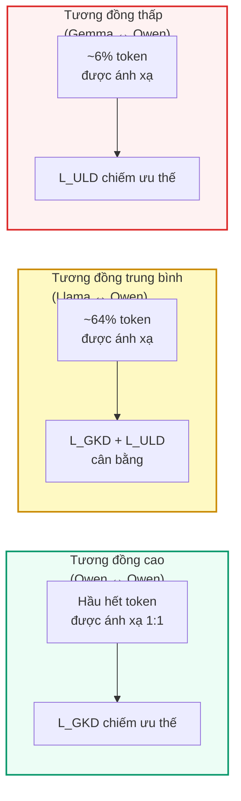

# Chương 4: Thiết lập Thí nghiệm

Chương này mô tả chi tiết thiết lập thí nghiệm được sử dụng để đánh giá hiệu quả của GOLD, bao gồm nhiệm vụ đánh giá, tập dữ liệu, các mô hình được sử dụng và phân tích mức độ tương đồng giữa các tokenizer.

## 1. Định nghĩa nhiệm vụ — Trò chơi Countdown

Chúng tôi sử dụng một trò chơi toán học gọi là **Countdown** (Gandhi et al., 2024), trong đó mục tiêu là đạt được một **giá trị đích (target value)** bằng cách sử dụng một nhóm các số và bốn phép toán số học ($+$, $-$, $\times$, $\div$).

Mô hình phải cung cấp câu trả lời theo một định dạng cụ thể. Chúng tôi chỉ coi câu trả lời là **đúng** nếu nó thỏa mãn **tất cả** các điều kiện sau:

:::important Điều kiện đánh giá đúng
1. **Mỗi số chỉ được sử dụng một lần** — không lặp lại bất kỳ số nào trong nhóm số đã cho.
2. **Phương trình cho ra kết quả đúng bằng giá trị đích** — biểu thức toán học phải được tính đúng.
3. **Câu trả lời phải nằm trong thẻ `<answer>` `</answer>`** — tuân thủ định dạng yêu cầu.
:::

**Ví dụ:**

```
Đề bài: Sử dụng các số [3, 7, 12, 25] để đạt giá trị đích 100.

✅ Đúng: <answer>(25 - 12) * 7 + 3 = 100</answer>
❌ Sai:   25 * 4 = 100           (dùng số 4 không có trong nhóm)
❌ Sai:   <answer>3 + 7 = 10</answer>  (kết quả không bằng 100)
```

## 2. Tập dữ liệu

Tất cả các prompt (câu lệnh đầu vào) được lấy từ tập dữ liệu **[Jiayi-Pan/Countdown-Tasks-3to4](https://huggingface.co/datasets/Jiayi-Pan/Countdown-Tasks-3to4)** trên HuggingFace.

| Thành phần | Số lượng |
|---|---|
| Prompt huấn luyện | 80.000 |
| Prompt kiểm tra | 10.000 |
| **Tổng cộng** | **90.000** |

Chúng tôi đã tạo các câu trả lời (responses) từ hai mô hình teacher:
- `Qwen/Qwen2.5-7B-Instruct`
- `Qwen/Qwen3-4B-Instruct-2507`

## 3. Các mô hình sử dụng

### Mô hình Teacher (Giáo viên)

Tất cả các teacher đều là các mô hình thuộc **họ Qwen** với kích thước khác nhau.

### Mô hình Student (Học sinh)

Các student đến từ **ba họ mô hình khác nhau**: Qwen, Llama và Gemma — nhằm kiểm chứng khả năng hoạt động xuyên họ mô hình (cross-family) của GOLD.

| Vai trò | Họ mô hình | Điểm Countdown ban đầu |
|---|---|---|
| **Teacher** | Qwen (nhiều kích thước) | 0.35 – 0.76 |
| **Student** | Qwen, Llama, Gemma | < 0.08 |

:::note Khoảng cách hiệu suất
Lưu ý khoảng cách hiệu suất đáng kể giữa teacher và student: teacher đạt điểm từ **0.35 đến 0.76**, trong khi tất cả student đều bắt đầu ở mức dưới **0.08**. Đây là thiết lập thách thức, kiểm tra khả năng chuyển giao tri thức thực sự của các phương pháp chưng cất.
:::

## 4. Độ tương đồng Tokenizer

### Giả thuyết

Chúng tôi đưa ra giả thuyết rằng hiệu suất của GOLD sẽ **tương quan với độ tương đồng từ vựng** giữa tokenizer của teacher và student.

### Chỉ số Jaccard (IoU)

Chúng tôi định nghĩa một **chỉ số tương đồng tokenizer** sử dụng **Jaccard Index** (hay còn gọi là Intersection over Union — IoU):

$$J(A, B) = \frac{|A \cap B|}{|A \cup B|}$$

Trong đó $A$ và $B$ là tập từ vựng của hai tokenizer.

### Kết quả so sánh

Bảng dưới đây trình bày độ tương đồng tokenizer giữa các cặp mô hình, được đo bằng hai phương pháp: **strict matching** (so khớp nghiêm ngặt — yêu cầu token giống hệt nhau) và **token content matching** (so khớp nội dung — chỉ cần nội dung chuỗi ký tự của token trùng nhau):

| Mô hình Student | Mô hình Teacher | Strict Matching | Content Matching |
|---|---|---|---|
| `Qwen2.5-*` | `Qwen2.5-7B` | ~1.0 | ~1.0 |
| `Qwen3-*` | `Qwen2.5-7B` | ~1.0* | ~1.0* |
| `meta-llama/Llama-3.2-1B-Instruct` | Tất cả teacher Qwen | **0.000** | **0.640** |
| `google/gemma-3-1b-it` | Tất cả teacher Qwen | **0.000** | **0.063** |

> *\*Sự khác biệt duy nhất giữa tokenizer Qwen2.5 và Qwen3 là Qwen3 có thêm bốn token đặc biệt: `<think>`, `<tool_response>`, `</tool_response>`, `</think>`.*

:::warning Quan sát quan trọng
- **Llama** và **Gemma** có độ tương đồng **0** với tất cả các teacher Qwen khi đo theo strict matching, nhưng tăng lên **0.64** và **0.063** tương ứng khi dùng content matching.
- Điều này cho thấy nhiều token có **cùng nội dung chuỗi ký tự** nhưng **khác ID** — chính xác là loại thông tin mà phương pháp căn chỉnh từ vựng của GOLD được thiết kế để khai thác.
:::

### Ý nghĩa đối với GOLD



Kết quả cho thấy:
- Với các cặp mô hình **cùng họ** (ví dụ: Qwen ↔ Qwen), phần lớn token được ánh xạ trực tiếp, nên $\mathcal{L}_{GKD}$ chiếm ưu thế.
- Với các cặp mô hình **khác họ** nhưng có từ vựng phần nào chồng lấn (Llama ↔ Qwen), cả hai thành phần loss đều đóng vai trò quan trọng.
- Với các cặp có từ vựng **rất khác biệt** (Gemma ↔ Qwen), $\mathcal{L}_{ULD}$ là thành phần chính, và phương pháp sắp xếp dự phòng trở nên thiết yếu.

---

➡️ Tiếp theo: Chương 5 — Kết quả Thí nghiệm *(sắp ra mắt)*
